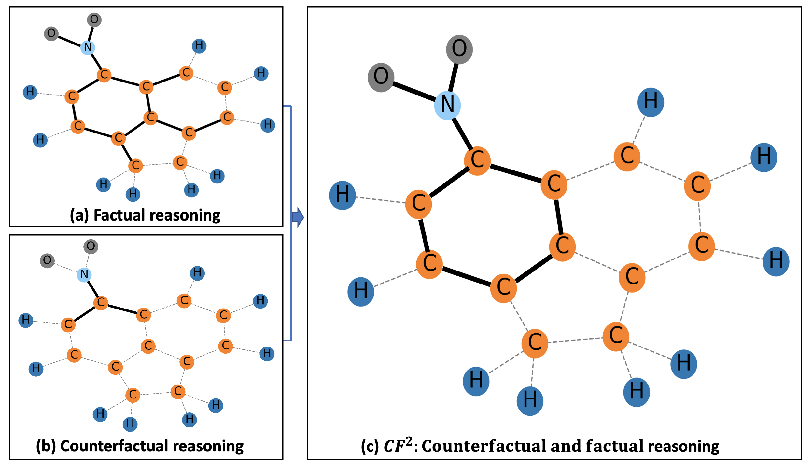

# Code for paper "Learning and Evaluating Graph Neural Network Explanations based on Counterfactual and Factual Reasoning (WWW 2022)"
## Overall
Pytorch implementation for paper "Learning and Evaluating Graph Neural Network Explanations based on Counterfactual and Factual Reasoning".


### Paper link: 
https://arxiv.org/pdf/2202.08816.pdf

## Requirements
- Python 3.7
- pytorch 1.9.0
- cuda 10.2
- ***dgl-cuda10.2

## Instruction
1. To run the experiments, dgl-cuda library is required. https://docs.dgl.ai/install/index.html.
2. After installing dgl-cuda library, Please replace the graphconv.py file in the dgl library with the file (with the same name) provided in the gnn_cff root folder. This is for the relaxation purpose as described in the paper.
3. The training and explaining are independent phases. For you convenience, we provide pre-trained GNN model params. Under the project root folder, run:
    ```
    unzip log.zip
    ```
4. To set the python path, under the project root folder, run:
    ```
    source setup.sh
    ```
5. As an example, to generate explanations for node classification task (Tree-Cycles dataset as example), run:
    ```
    python scripts/exp_node_tree_cycles.py
    ```
6. For generating explanations for graph classification task (Mutag0 dataset as example), run:
    ```
    python scripts/exp_graph.py
    ```
7. The codes for training GNNs are also provided. For instance, for training GNN for node classification, run:
    ```
    python scripts/train_node_classification.py
    ```
    for graph classification, run:
    ```
    python scripts/train_graph_classification.py
    ```
